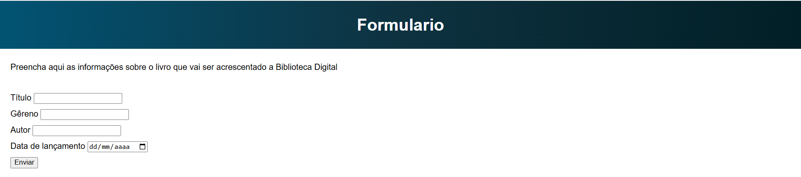

# Formulário HTML Básico

Um mini projeto para praticar a criação de formulários usando HTML básico.

## Funcionalidades

- Formulário para adicionar um livro simples
- Campos básicos como Título, Autor e Ano de lançamento do livro

## Como usar

1. Clone este repositório ou faça o download dos arquivos
2. Abra o arquivo `index.html` no seu navegador
3. Preencha os campos do formulário